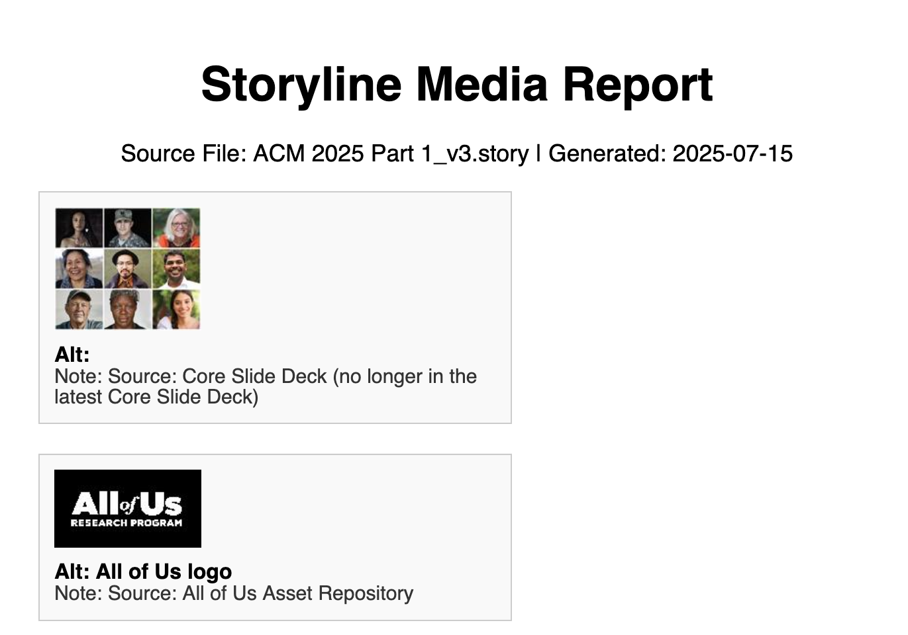

> [!IMPORTANT]  
> This tool is not affiliated with or endorsed by Articulate.  
> It processes .story files using standard XML/media parsing.  
> No reverse-engineering of Storyline software is involved.  

> [!NOTE]  
> This is for educational and internal use only.  
> Plus it only works in very specific circumstances, so use at your own risk. ☠️
***

# Storyline Media Report

Generate a simple HTML or PDF report showing all media assets from an Articulate Storyline `.story` project PLUS thumbnails, alt text, and internal notes (from the Media Library).

## What It Does

- Extracts media assets from a `.story` file (which is just a ZIP archive).
- Matches media files by checksum with entries in `story/story.xml`.
- Collects:
  - Thumbnail of each image (resized)
  - Internal notes (from the `note` attribute)
  - Alt text (from `<altText>` tag)
- Outputs:
  - A compact, shareable **HTML** file
  - Or a printable **PDF report** (with poor layout so far 🤬)

---

## Requirements

- Python 3.8+
- Pillow (`pip install Pillow`)
- FPDF2 (if generating PDF: `pip install fpdf`)

---

## How to Use
For HTML output:
```bash
python storyline_media_to_html.py "your_project.story"
```

For PDF output:
```bash
python storyline_media_to_pdf.py "your_project.story"
```

## Output

- storyline_media_report.html — Viewable in any browser.
- storyline_media_report.pdf — Portable format for documentation or reviews.

Each entry shows:

- A small image preview
- Alt text
- Internal note (entered using Storyline Media Library)

HTML output:  



## Example Repo Structure

```
storyline-media-report/
├── storyline_media_to_pdf.py
├── storyline_media_to_html.py
├── generate_report.bat
├── README.md
└── sample.story (not included)
```

## License

MIT License. Use freely, modify, share — and credit if you feel generous.

---

I'm always interested in collaborating to build new tools for learners, instructional designers, and whoever. Let me know if you are interested in a specfic application or just want to see what we can do together.
